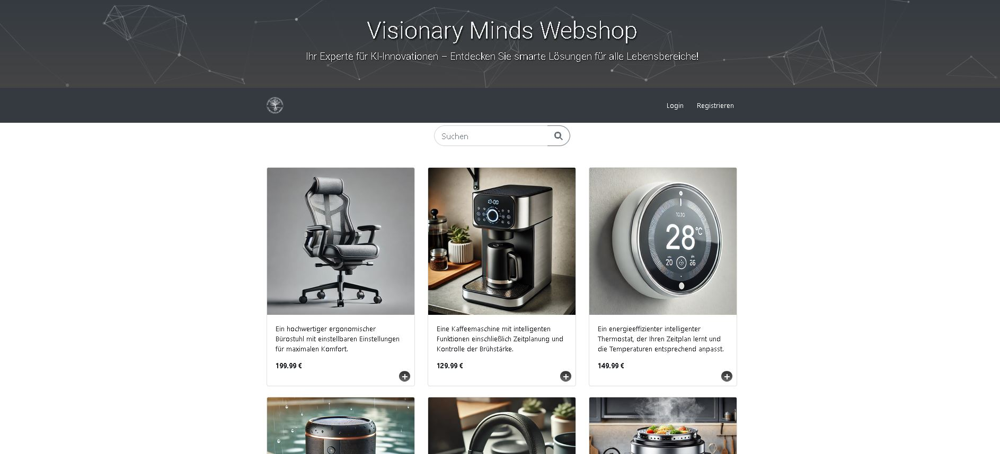
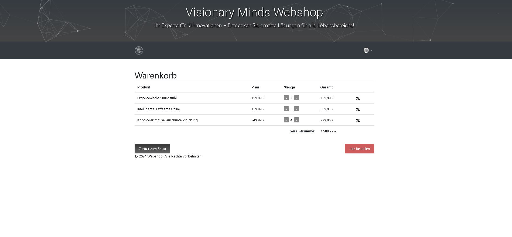
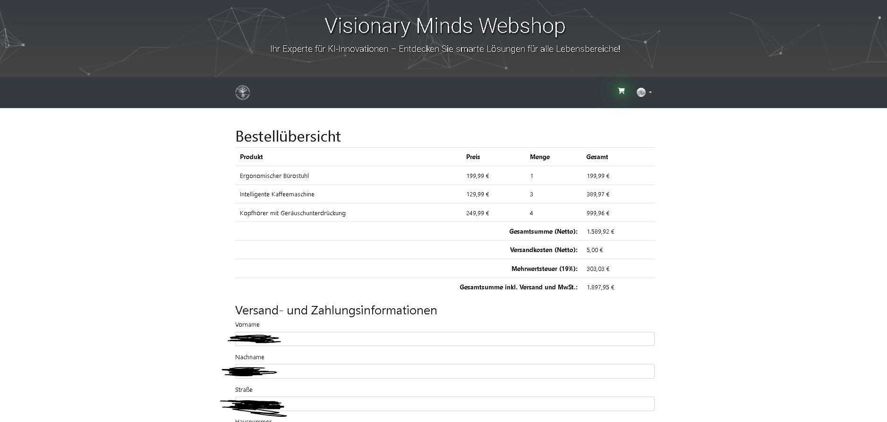

# 🛒 Webshop

[](https://www.php.net/releases/7_4_0.php)
[](https://dev.mysql.com/downloads/mysql/5.7.html)






## 📖 Inhaltsverzeichnis
1. [Einführung](#1-einführung)
2. [Features](#2-features)
3. [Installation](#3-installation)
4. [Verwendung](#4-verwendung)
5. [Technologien](#5-technologien)
6. [Autoren](#6-autoren)

## 1. Einführung

Dieses Projekt ist ein Webshop in PHP und MySQL.

## 2. Features

- 🖼️ **Produktanzeige** mit Bildern und Beschreibungen
- 🔍 **Suchfunktion** für Produkte
- 🛒 **Warenkorb** mit der Möglichkeit, Produkte hinzuzufügen und zu entfernen
- 👤 **Benutzerregistrierung und -anmeldung**
- 🛠️ **Benutzerprofilseite**
- 🔐 **Admin-Bereich** zur Verwaltung von Produkten und Benutzern
- 💳 **Zahlungssystemintegration** (PayPal, Kreditkarte, Banküberweisung)

## 3. Installation

### Voraussetzungen:

- XAMPP oder ein ähnlicher Webserver mit PHP und MySQL
- Webbrowser

### Schritte:

1. **Repository klonen:**

    ```
    git clone https://github.com/EtherEngine/Webshop.git
    ```

2. **In das Projektverzeichnis wechseln:**

    ```
    cd path/to/your/webshop
    ```

3. **Projektdateien in das XAMPP-htdocs-Verzeichnis kopieren.**

4. **Apache- und MySQL-Server über das XAMPP-Kontrollpanel starten.**

5. **Datenbank erstellen und Schema importieren:**

    - Öffne phpMyAdmin.
    - Erstelle eine neue Datenbank namens `webshop`.
    - Importiere die mitgelieferte SQL-Datei `db.sql`, um die benötigten Tabellen und Daten zu erstellen:

        
        - Wähle die neu erstellte `webshop`-Datenbank aus.
        - Navigiere zum Tab "Import" und lade die `webshop.sql`-Datei hoch.


## 4. Verwendung

- **Webshop Startseite:**  
  Öffne deinen Webbrowser und navigiere zu `http://localhost/webshop/public/index.php`.

- **Benutzerregistrierung:**  
  Klicke auf "Registrieren" und fülle das Formular aus, um ein neues Benutzerkonto zu erstellen.

- **Produkte durchsuchen:**  
  Verwende die Suchleiste auf der Startseite, um nach Produkten zu suchen. Klicke auf ein Produktbild, um die Produktdetails anzuzeigen.

- **Produkte zum Warenkorb hinzufügen:**  
  Klicke auf das Plus-Symbol (+) auf einem Produkt, um es deinem Warenkorb hinzuzufügen. Verwende das Popup-Fenster, um die Anzahl der Produkte anzugeben.

- **Warenkorb anzeigen und bearbeiten:**  
  Klicke auf das Warenkorb-Symbol in der Navigation, um deinen Warenkorb anzuzeigen. Ändere die Produktmengen oder entferne Produkte aus dem Warenkorb.

- **Checkout:**  
  Klicke auf "Zur Kasse", um zur Zahlungsseite zu gelangen. Wähle eine Zahlungsmethode aus und folge den Anweisungen zur Zahlung.

## 5. Technologien

- 🐘 **PHP**
- 🐬 **MySQL**
- 🌐 **HTML**
- 🎨 **CSS (Bootstrap)**
- ⚡ **JavaScript (jQuery)**
- 🌟 **FontAwesome**

## 6. Autoren

- **Alex F.** - [GitHub](https://github.com/EtherEngine)

---


